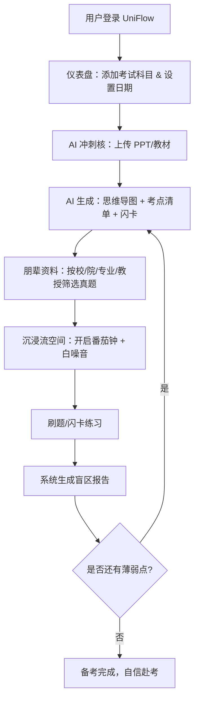

# UniFlow（优流备考）— 产品需求文档 (PRD)

## 1. 产品概述

UniFlow 是一款专为大学生期末复习周设计的高颜值、高效率备考平台。通过 AI 智能提取考点、朋辈精准资料匹配、沉浸式伴学空间，解决大学生考前信息过载、复习无序、资料不对口、专注力不足四大核心痛点。

- 目标用户：全国高校在校大学生（期末备考阶段）
- 核心价值：用 AI 提效帮用户省时间，用本校朋辈资料实现精准过关，用沉浸伴学帮用户克服焦虑

## 2. 核心功能

### 2.1 用户角色

| 角色 | 注册方式 | 核心权限 |
|------|----------|----------|
| 普通学生 | 邮箱/手机号注册 | 浏览仪表盘、使用 AI 工具、下载资料、进入自习室 |
| 资料贡献者 | 注册后申请 | 上传真题/笔记、获取积分奖励 |

### 2.2 功能模块

1. **高光仪表盘 (Dashboard)**：考试倒计时、心流时长、进度追踪、盲区热力图
2. **AI 冲刺核 (AI Engine)**：PPT/教材导入、思维导图生成、闪卡制作、考点精简
3. **朋辈资料矩阵 (Peer Hub)**：按高校-学院-专业-教授分类的真题/笔记/押题卷
4. **沉浸流空间 (Flow Chamber)**：虚拟自习室、番茄钟、白噪音、伴学组队

### 2.3 页面详情

| 页面名称 | 模块名称 | 功能描述 |
|----------|----------|----------|
| 仪表盘页 | 考试倒计时卡片 | 展示各科目考试 DDL 动态倒计时，支持添加/删除科目 |
| 仪表盘页 | 心流时长统计 | 今日专注时长环形图，本周复习时长趋势折线图 |
| 仪表盘页 | 科目进度条 | 各科目复习进度百分比条，可手动调整 |
| 仪表盘页 | 盲区热力图 | 按知识点维度展示薄弱区域，颜色深浅代表掌握程度 |
| AI 冲刺核页 | 文件上传区 | 拖拽上传 PPT/PDF/文档，AI 自动解析 |
| AI 冲刺核页 | 思维导图 | 将上传内容自动生成可交互的思维导图 |
| AI 冲刺核页 | 闪卡模式 | Anki 式记忆闪卡，支持翻转、标记掌握/未掌握 |
| AI 冲刺核页 | 考点清单 | 精简考点列表，一句话大白话解释 |
| 朋辈资料页 | 资料筛选器 | 四级标签筛选：高校→学院→专业→教授 |
| 朋辈资料页 | 资料卡片列表 | 展示真题/笔记/押题卷，含评分、下载量、积分价格 |
| 朋辈资料页 | 资料详情弹窗 | 预览资料内容、评论、下载按钮 |
| 沉浸流空间页 | 虚拟自习室 | 可见在线人数的匿名自习室，支持创建/加入 |
| 沉浸流空间页 | 番茄钟 | 暗黑风格番茄钟，25/5 模式，可自定义时长 |
| 沉浸流空间页 | 白噪音面板 | 雨声、考场沙沙声、低音环境音等可叠加播放 |
| 导航栏 | 全局导航 | 四大模块切换 + 用户头像 + 通知铃铛 |

## 3. 核心流程

用户打开 UniFlow 后的核心复习链路：

1. **导入课业，圈定范围**：在仪表盘选择本学期考试科目，绑定考试日期，触发 DDL 倒计时
2. **AI 瘦身，提取骨架**：拖入复习大纲或讲义 PPT，AI 自动重构为极简考点清单和思维导图
3. **匹配本校"通关秘籍"**：系统根据高校和专业推荐同系学长学姐上传的历年真题和笔记
4. **沉浸刷题与弱点诊断**：开启番茄钟在线刷题/抽认卡，系统生成知识盲区报告

## 4. 用户界面设计

### 4.1 设计风格

- **主色调**：深色背景（#0a0a0f → #12121a 渐变），霓虹高亮色（极客蓝 #00d4ff、极光绿 #00ff88、渐变紫 #8b5cf6）
- **布局风格**：便当盒布局（Bento Grid）+ 毛玻璃卡片（Glassmorphism）
- **按钮风格**：圆角胶囊按钮，霓虹发光边框，hover 时发光增强
- **字体**：标题使用 Outfit（现代几何感），正文使用 Noto Sans SC（中文优化）
- **图标风格**：线性图标（Lucide），配合霓虹色发光效果
- **动效**：卡片悬浮微动、数据加载骨架屏、页面切换淡入、倒计时数字翻转

### 4.2 页面设计概览

| 页面名称 | 模块名称 | UI 元素 |
|----------|----------|---------|
| 仪表盘页 | 考试倒计时卡片 | Bento Grid 布局，毛玻璃卡片，霓虹蓝数字，翻转动画 |
| 仪表盘页 | 心流时长统计 | 环形进度图（SVG），霓虹绿渐变填充，中心数字 |
| 仪表盘页 | 科目进度条 | 水平进度条，渐变色填充，百分比标签 |
| 仪表盘页 | 盲区热力图 | 网格热力图，红→黄→绿渐变，hover 显示知识点名 |
| AI 冲刺核页 | 文件上传区 | 虚线边框拖拽区，霓虹蓝虚线，拖入时发光效果 |
| AI 冲刺核页 | 思维导图 | Canvas 绘制，节点可展开/收起，连线带流动动画 |
| AI 冲刺核页 | 闪卡模式 | 3D 翻转卡片，正面问题/背面答案，左右滑动切换 |
| 朋辈资料页 | 资料卡片列表 | 瀑布流/网格布局，缩略图 + 标签 + 评分星 |
| 朋辈资料页 | 筛选器 | 侧边栏四级级联选择器，毛玻璃背景 |
| 沉浸流空间页 | 虚拟自习室 | 在线用户头像墙（匿名头像），氛围灯光效果 |
| 沉浸流空间页 | 番茄钟 | 大号圆形倒计时，霓虹发光环，呼吸动画 |
| 沉浸流空间页 | 白噪音面板 | 圆形图标按钮组，选中时脉冲动画，音量滑块 |

### 4.3 响应式设计

- 桌面优先（Desktop-first），最小宽度 1280px 为主要适配
- 平板端（768px-1279px）：Bento Grid 自动收缩为 2 列
- 移动端（< 768px）：单列堆叠，底部 Tab 导航替代侧边栏

### 4.4 3D 场景指引

本项目不涉及 3D 场景。
