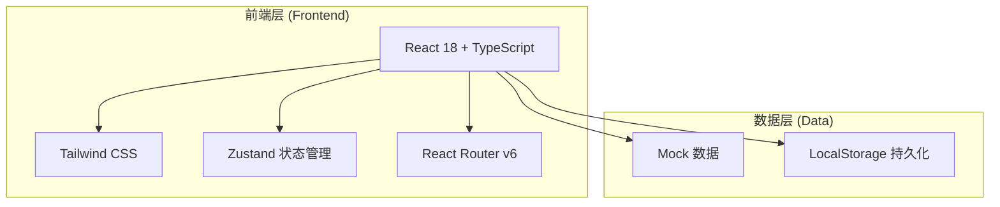
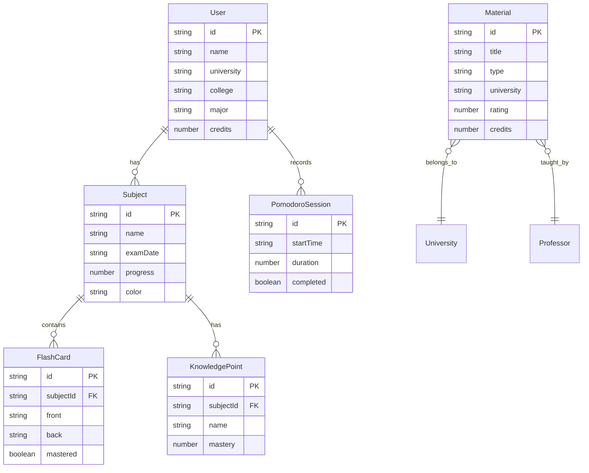

# UniFlow（优流备考）— 技术架构文档

## 1. 架构设计



本项目为纯前端项目，使用 Mock 数据模拟后端接口，LocalStorage 做数据持久化。

## 2. 技术说明

- **前端框架**：React 18 + TypeScript
- **样式方案**：Tailwind CSS 3 + 自定义 CSS 变量（霓虹主题）
- **构建工具**：Vite
- **状态管理**：Zustand
- **路由**：React Router DOM v6
- **图标库**：Lucide React
- **动画**：Framer Motion
- **图表**：Recharts（进度图、趋势图）
- **后端**：无（纯前端，Mock 数据）
- **数据库**：无（LocalStorage 持久化）

## 3. 路由定义

| 路由 | 用途 |
|------|------|
| `/` | 重定向至仪表盘 |
| `/dashboard` | 高光仪表盘 — 考试倒计时、心流时长、进度追踪、盲区热力图 |
| `/ai-engine` | AI 冲刺核 — 文件上传、思维导图、闪卡、考点清单 |
| `/peer-hub` | 朋辈资料矩阵 — 资料筛选、卡片列表、详情弹窗 |
| `/flow-chamber` | 沉浸流空间 — 自习室、番茄钟、白噪音 |

## 4. API 定义

本项目为纯前端，使用 Mock 数据。以下为模拟的 API 接口设计：

```typescript
// 科目相关
interface Subject {
  id: string;
  name: string;
  examDate: string;
  progress: number; // 0-100
  color: string;
}

// 资料相关
interface Material {
  id: string;
  title: string;
  type: 'exam' | 'notes' | 'cheatsheet';
  university: string;
  college: string;
  major: string;
  professor: string;
  rating: number;
  downloads: number;
  credits: number;
  tags: string[];
}

// 闪卡相关
interface FlashCard {
  id: string;
  subjectId: string;
  front: string;
  back: string;
  mastered: boolean;
}

// 番茄钟记录
interface PomodoroSession {
  id: string;
  startTime: string;
  duration: number;
  subjectId: string;
  completed: boolean;
}

// 白噪音类型
type WhiteNoiseType = 'rain' | 'library' | 'cafe' | 'bass' | 'forest' | 'fire';
```

## 5. 数据模型

### 5.1 数据模型定义



### 5.2 数据初始化

使用 Mock 数据文件提供初始数据，包括：
- 预设 4-5 个典型科目（高等数学、大学物理、线性代数、数据结构等）
- 预设 10+ 份朋辈资料
- 预设 20+ 张闪卡
- 预设白噪音配置
